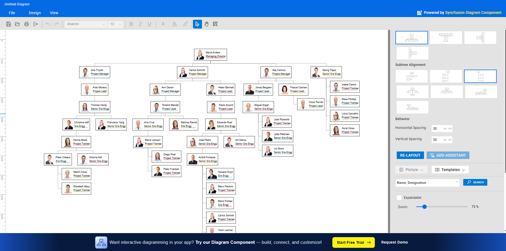

# Syncfusion® EJ2 React Organizational Chart Showcase

An interactive organizational chart (also called an organogram or hierarchy chart) built using Syncfusion®  Essential Studio® for React. This showcase demonstrates how to build dynamic, responsive visualizations of organizational structures that highlight relationships, roles, and reporting lines across individuals, teams, and departments. Ideal for HR systems, enterprise dashboards, and management tools.

## Why Use This React Organizational Chart?
In fast-moving organizations, clear visibility into hierarchy accelerates decision-making and collaboration. This interactive org chart helps you:
- Streamline onboarding by mapping team structures.
- Improve clarity with explicit reporting lines.
- Boost productivity through intuitive hierarchy navigation.

Optimized for modern web development, this showcase leverages Syncfusion® React high-performance UI components to deliver professional hierarchy chart solutions. Keywords: React organizational chart, interactive organogram, hierarchy visualization, Syncfusion React Diagram, company structure diagram.

## Key Features
- Interactive Navigation: Zoom, pan, and expand/collapse nodes for seamless exploration of large hierarchies.
- Data Binding: Bind JSON or remote data representing roles, departments, and reporting relationships.
- Customization: Control layouts (horizontal/vertical), node templates, connectors, and tooltips.
- Responsive Design: Automatically adapts to desktops, tablets, and mobiles for cross-device compatibility.
- Export: Save charts as PDF, PNG, or SVG.
- Accessibility: WCAG-friendly, ensuring usability for all users.
- Performance: Handles large organizations efficiently with optimized layout and virtualization.

## Syncfusion® Components Used
This showcase primarily uses the following Syncfusion® EJ2 React packages:
- `@syncfusion/ej2-react-diagrams`: Core package for building interactive diagrams, including nodes, connectors, layouts, and organizational charts.
- DataBinding module: Binds external data (e.g., JSON arrays) to automatically generate nodes and connectors.
- HierarchicalTree layout module: Provides automatic layout for hierarchical structures.

For a deep dive, refer to the [Organizational Chart](https://ej2.syncfusion.com/react/documentation/diagram/org-chart) section in the EJ2 Diagram documentation.

## Getting Started

### Prerequisites
- Node.js >= 18.20.3 (npm is installed with Node)

### Install & Run
To get the app up and running:

1) Clone the repository:
```bash
git clone https://gitea.syncfusion.com/essential-studio/ej2-react-organizational-chart.git
cd ej2-react-organizational-chart
```

2) Install dependencies:
```bash
npm install
```

3) Run in development mode:
```bash
npm run start
```

Then open http://localhost:8080 in your browser.

## Usage (Basic Example)
For a quick start on setting up a React project with Syncfusion® Diagram, refer to our [Getting Started guide](https://ej2.syncfusion.com/react/documentation/diagram/getting-started).

Below is a minimal React setup to render an Organizational Chart.

1. **App Component (`App.js` or `App.jsx`)**

Import and configure Syncfusion® Diagram for React:

```jsx
import { createRoot } from 'react-dom/client';
import * as React from 'react';
import { DiagramComponent, Inject, DataBinding, HierarchicalTree } from '@syncfusion/ej2-react-diagrams';
import { DataManager, Query } from "@syncfusion/ej2-data";

// Sample hierarchical data
const organizationalData = [
    { Id: '1', Role: 'President', Name: 'Alice Johnson' },
    { Id: '2', Role: 'VP Engineering', Name: 'Bob Lee', ReportingPerson: '1' },
    { Id: '3', Role: 'VP Marketing', Name: 'Carol Davis', ReportingPerson: '1' }
];

function App() {
    // Data binding specifics
    const dataSourceSettings = {
        id: 'Id',
        parentId: 'ReportingPerson',
        dataSource: new DataManager(organizationalData, new Query().take(7)),
        doBinding: (nodeModel, data, diagram) => {
            nodeModel.annotations = [{ content: data.Role, style: { color: 'white' } }];
        }
    };

    return (
        <div style={{ width: "100%", height: "600px" }}>
            <DiagramComponent
                id="container"
                width={'100%'}
                height={'600px'}
                layout={{ type: 'OrganizationalChart' }}
                dataSourceSettings={dataSourceSettings}
            >
                <Inject services={[DataBinding, HierarchicalTree]} />
            </DiagramComponent>
        </div>
    );
}

export default App;
```

### Customizing for Your Use Case
This showcase is designed to be flexible and adaptable to various business needs, such as HR management, project team visualizations, or corporate directory tools. Below are step-by-step guidelines on how to modify and extend the application to fit your specific requirements. These adaptations leverage Syncfusion® React's robust customization capabilities, ensuring seamless integration into your workflows.

#### Modifying the Data
The organizational chart is powered by a simple JSON data structure, making it easy to replace the sample data with your own hierarchy.
Locate the data array, which represents nodes with properties like Id, Name, Role, and Team (the parent-child relationship key).

```js
// Example data source for EJ2 React Diagram
const organizationalData = [
  { Id: '1', Role: 'General Manager' },
  { Id: '2', Role: 'Human Resource Manager', Team: '1' },
  { Id: '3', Role: 'Design Manager', Team: '1' },
  { Id: '4', Role: 'Operations Manager', Team: '1' },
  { Id: '5', Role: 'Marketing Manager', Team: '1' }
];
```
Tips: Ensure unique Id values and valid Team references to avoid rendering issues. This is ideal for real-time updates in enterprise applications.

#### Customizing Styles
- Node Templates: Enhance nodes with images, icons, or additional fields using HTML/JS templates (e.g., annotations, tooltip templates, or setNodeTemplate/getNodeDefaults in EJ2 Diagram).
- Layout Options: Tune spacing and alignment using diagram.layout (type, horizontalSpacing, verticalSpacing, orientation) and a custom `getLayoutInfo` callback for side assignment.
- Styling: Override node and connector styles directly in code.

```js
    // Diagram node defaults
    const getNodeDefaults = (node) => {
        node.shape = { type: 'Basic', shape: 'Rectangle' };
        node.width = 95;
        node.height = 30;
        node.style = { fill: 'darkcyan', strokeColor: 'black', strokeWidth: 1 };
        return node;
    }
    // Connector defaults
    const getConnectorDefaults = (connector) => {
        connector.type = 'Orthogonal';
        connector.style = { strokeColor: '#4d4d4d' };
        connector.targetDecorator = { shape: 'None' };
        return connector;
    }

    // <DiagramComponent getNodeDefaults={getNodeDefaults} getConnectorDefaults={getConnectorDefaults} />
```


#### Styling and Theming
- Switch built-in themes by changing the CSS reference (Material, Bootstrap 5, Fluent, etc.).
- Use Theme Studio to generate a custom theme CSS and replace the default stylesheet.
Example theme reference:
```html
<link href="https://cdn.syncfusion.com/ej2/30.1.37/fluent.css" rel="stylesheet">
```

#### Interactions and Events
- Handle node/connector events for simulation toggles, selections, and property edits.
- Implement keyboard shortcuts for delete, duplicate, align, and distribute.

#### Persistence and Integration
- Serialize the diagram to JSON for save/load and sharing.
- Integrate with other Syncfusion® React components like DataGrid for parts lists or Toast for notifications.
Best Practices: Keep node text concise, validate hierarchy during edits, and optimize large diagrams for performance.

## Demo
- Web: https://ej2.syncfusion.com/showcase/react/organizationalchart/
- Screenshot: 

## Contributing
We welcome contributions! Fork the repo, make your changes, and submit a pull request. Please follow contribution best practices.

## License
Syncfusion® libraries require a valid license key in production. License guidance:
https://ej2.syncfusion.com/react/documentation/licensing/overview/

## Support
- Open issues in this repository’s Issues section: https://gitea.syncfusion.com/essential-studio/ej2-react-organizational-chart/issues
- Explore more Syncfusion® React components: https://www.syncfusion.com/react-components
- Community forums: https://www.syncfusion.com/forums

Optimize your organizational chart React implementations today with Syncfusion®– the ultimate tool for professional hierarchy visualizations!

